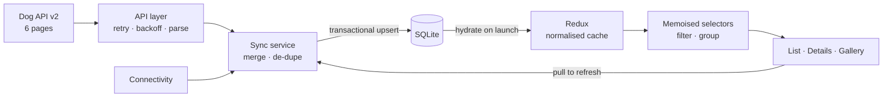
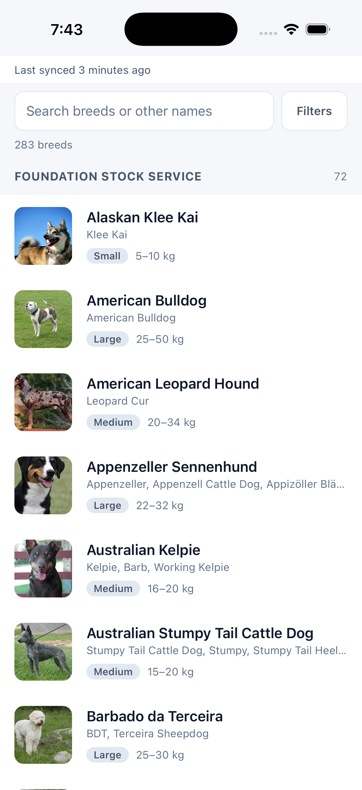
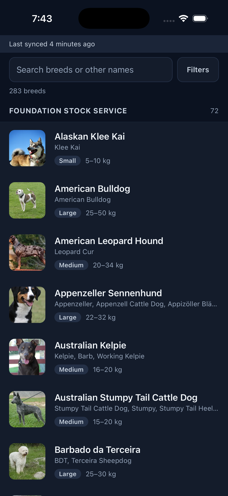
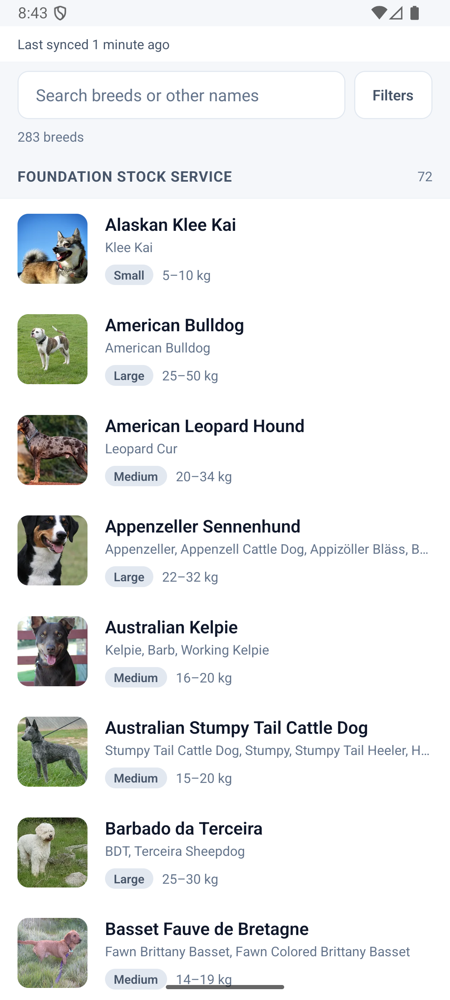
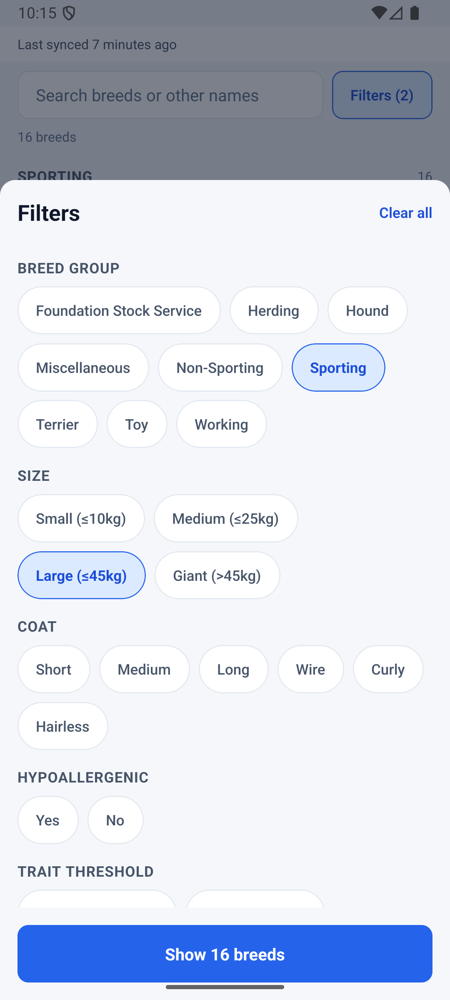
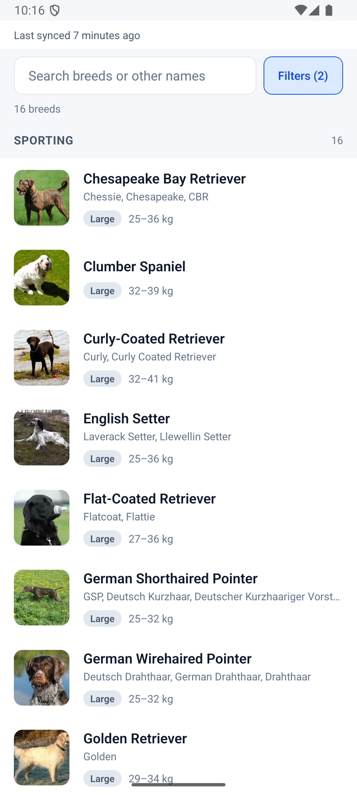
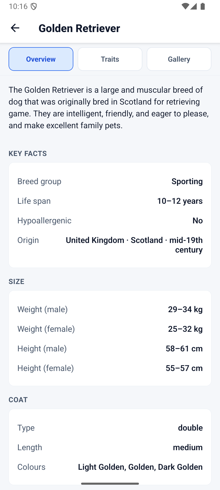
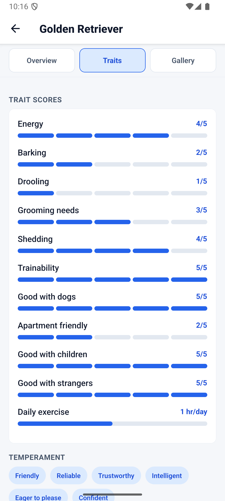
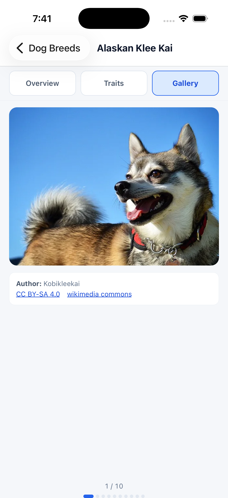

# Dog Breed Explorer

An offline-first React Native app for browsing all 283 breeds from the
[Dog API v2](https://dogapi.dog/docs/api-v2), built for the Tripare AI
React Native assessment.

Built with React Native (Expo SDK 57) · TypeScript strict · Redux Toolkit ·
SQLite · TanStack Query · React Navigation.

---

## Quick start

```bash
npm install
cp .env.example .env     # optional — see "Environment" below
npm run ios              # or: npm run android
```

`npm test` runs the suite (197 tests). `npm run typecheck` runs `tsc --noEmit`.

**Requirements:** Node 18+, and Xcode (iOS) or Android Studio + JDK 17
(Android). The first `npm run ios` compiles the native project and takes a few
minutes; subsequent runs are fast.

### Environment

**The Dog API requires no key or auth token, so `.env` is optional** — the app
ships with working defaults and runs correctly without it. `.env.example`
exists only so the base URL and network tuning can be changed without editing
code (for example, pointing at a mock server):

| Variable | Default | Purpose |
|---|---|---|
| `EXPO_PUBLIC_DOG_API_BASE_URL` | `https://dogapi.dog/api/v2` | API base URL |
| `EXPO_PUBLIC_API_TIMEOUT_MS` | `15000` | Per-request timeout |
| `EXPO_PUBLIC_API_MAX_RETRIES` | `3` | Retry attempts (exponential backoff) |
| `EXPO_PUBLIC_API_PAGE_SIZE` | `48` | Records per page (see note below) |

Values are validated, not trusted: a malformed number falls back to its default
rather than producing a `NaN` timeout.

---

## Architecture overview

The app is built around one rule: **SQLite is the source of truth for what the
user sees; the network is an optimisation.** On launch, the app reads its local
database and renders immediately — before any network call. Synchronisation is
a background process that updates that database, and the UI re-reads from it.
This is what makes a cold start in aeroplane mode behave identically to a cold
start on wifi.

Data flows in one direction. The API layer fetches all six pages concurrently,
narrows every untrusted JSON payload into typed domain objects through total
parsers (no `any`, no throwing), and merges the pages into one de-duplicated
dataset. The sync service writes that result to SQLite as a **transactional
upsert**, never a delete-and-replace. Repositories then read it back, Redux
holds a normalised projection, and memoised selectors derive the filtered,
grouped list the UI renders.

The consequence of that design is how failure behaves. If two of six pages
fail, the four that succeeded are written, the user keeps the breeds they
already had, a non-blocking banner names the failed pages, and the "last
synced" timestamp does *not* advance. If the first page fails, nothing is
written at all. **A failed sync never leaves the user worse off than before it
started.**



Full detail: [docs/ARCHITECTURE.md](docs/ARCHITECTURE.md) ·
[docs/DECISIONS.md](docs/DECISIONS.md) ·
[docs/PERFORMANCE.md](docs/PERFORMANCE.md)

---

## Key technical decisions

**Why Redux Toolkit?** `createEntityAdapter` gives a normalised `{ids,
entities}` cache — O(1) detail lookup, a pre-sorted id array for the list — and
`createSelector` is the mechanism that keeps filtering off the render path.
Context+Reducer was ruled out because it cannot express "re-render only what
changed", which a 283-row list needs.

**Why SQLite?** AsyncStorage would mean deserialising all 283 rich records to
filter any of them, and rewriting the entire blob to update one breed. SQLite
makes filtering an indexed query and a sync a transactional upsert. Columns the
list filters on (`group_id`, `size_band`, `coat_category`, `hypoallergenic`,
three trait scores) are scalar and indexed; rarely-queried nested structures
are JSON.

**Why TanStack Query — and why only for details?** React Query is an in-memory
server-state cache. It handles the single-breed detail request well. The
catalogue is *not* in it: that data must survive process death, support indexed
multi-facet filtering, and be written transactionally from a partial result —
all database work. Query retries are disabled because the API layer already
retries with backoff.

**Why React Navigation?** Native stack navigator with a single
`RootStackParamList` as the source of truth, so a param rename is a compile
error at every call site rather than a runtime `undefined`.

**Offline sync strategy.** Render from cache first → probe connectivity → sync
only if the cache is empty or older than 6 hours → re-sync on the
offline→online *edge* and on foreground when stale. Writes are upserts inside a
transaction. A run that yields zero breeds is treated as an error, not a wipe.

**Image caching strategy.** Tiered by context: list thumbnails are
`memory-disk` (283 small files the user scrolls past every session — worth
persisting for offline relaunch); the detail hero is `memory-disk`; gallery
slides are memory-only, and only the *active* slide upgrades to `large`.
Caching every variant of ~2,400 images would be hundreds of MB of
mostly-unviewed data.

---

## Notes on the source data

Probing the live API surfaced several things worth stating, because they
contradict or extend the brief:

- **Pagination.** The API's *default* page size is 30 (10 pages), not 48.
  `page[size]=48` is supported and yields the 6 pages the brief describes, so
  the app passes it explicitly and drives the loop from
  `meta.pagination.last`. Code that assumed "6 pages" without setting the size
  would have silently lost 103 breeds.
- **`exercise_minutes` is not a 1-5 score.** It ranges 20–120. It is rendered
  as a duration with its own scale, not crammed onto a 5-point bar.
- **"Wire" is a coat *type*, not a length.** The API splits `coat.type`
  (wire/curly/corded/…) from `coat.length` (short/medium/long/hairless). The
  single filter the brief asks for is derived from both.
- **Missing data uses empty objects, not nulls.** One breed (Bavarian Mountain
  Scent Hound) ships `traits: {}`, `coat: {}`, `origin: {}` and empty height
  objects. `origin.era` is absent on 104 breeds, `region` on 50.
- **Image counts run to 10**, not the "up to 9" the brief states.

A missing trait is modelled as `null`, never `0` — an empty bar reading
"scores lowest" is a different and false claim from "not rated".

---

## Features

**Breed list** — all 283 breeds, virtualised and grouped by breed group, with
debounced search across `name` and `other_names`, pull-to-refresh, thumbnails,
skeleton/empty/error states and a non-blocking sync banner.

**Filters** (multi-select, composable — values within a facet OR, facets AND):
breed group · size band · coat · hypoallergenic · trait threshold. So
`Sporting + Large + Hypoallergenic + good_with_children ≥ 4` is expressible.

**Breed details** — Overview (description, lifespan, weight/height for both
sexes, origin, other names, kennel clubs), Traits (11 traits as visual scales
plus temperament tags), Gallery (swipeable, with author/license/source
attribution surfaced per image).

**Offline** — full functionality after the first sync, background sync on
reconnect, "Last synced 2 hours ago" freshness, and partial-failure handling
that preserves cached data.

---

## Performance report

Measured figures and the commands that produced them are in
[docs/PERFORMANCE.md](docs/PERFORMANCE.md).

| Metric | Value |
|---|---|
| Android JS bundle (release) | **3.44 MB** Hermes bytecode, 1,407 modules |
| Full sync, 6 pages / 283 breeds | **~4.4s** (concurrent), 0 duplicates, 0 parse failures |
| Partial failure (2 of 6 pages down) | **187 breeds recovered**, cache preserved |
| Test suite | **197 tests, 9 suites** |

Verified running on **both platforms**: iOS 26 simulator (iPhone 17 Pro) and
Android emulator (API 36), from the same source with no platform branching.

**Device profiling is not yet captured.** Time-to-interactive, sustained FPS
and memory must be recorded on a physical device; PERFORMANCE.md contains the
exact commands and `TODO` markers for each. No profiling number is estimated or
quoted here that was not actually measured.

---

## Screenshots

### Breed list — light and dark

| iOS (light) | iOS (dark) |
|---|---|
|  |  |

**Android** — same source, no platform branching:



### Filters

Multi-select facets compose: selecting **Sporting + Large** narrows 283 breeds
to 16, with the count updating live on the Apply button.

| Filter sheet (2 facets active) | Result: every row is Sporting AND Large |
|---|---|
|  |  |

### Breed details

| Overview | Traits |
|---|---|
|  |  |

The Traits tab shows the ten 1-5 scores as segmented scales, and
`exercise_minutes` as a **separate proportional bar labelled in real units**
("1 hr/day") — it ranges 20-120 in the source data, so a 5-point scale would
misrepresent it.

**Gallery with attribution** — author, licence and source surfaced per image,
as tappable links:



## Testing

```bash
npm test                 # 197 tests, 9 suites
npm run test:coverage
npm run typecheck        # tsc --noEmit, strict
```

| Suite | Covers |
|---|---|
| `parsers` | Malformed payloads, sparse records, null-vs-zero traits, attribution retention |
| `pagination` | 6-page merge, duplicate collapse, partial-page survival, page-1 failure |
| `client` | Retry policy, full-jitter backoff, timeout vs cancellation, error classification |
| `syncService` | Partial failure, cache preservation, empty-response guard, concurrency |
| `database` | SQL builder, LIKE escaping, row mapping, corrupt-JSON tolerance |
| `upsert` | Shipped SQL against a **real** SQLite engine (`sql.js`) |
| `filters` | Search, every facet, composed filters, grouping, selector memoisation |
| `derive` | Size-band and coat-category boundaries |
| `ui` | Trait scales, banner decision table, formatters, relative time |

The most load-bearing test is in `upsert.test.ts`: it runs the shipped
migrations and upsert statement against a real SQL engine and asserts that a
partial sync mentioning 1 of 3 breeds leaves the other 2 intact.

---

## Project structure

```
src/
├── api/          client, parsers, breeds/groups endpoints, typed errors
├── components/   list row, gallery, filter sheet, trait scales, banner, states
├── database/     connection, migrations, row mappers, repositories/
├── hooks/        useOfflineSync, useBreedDetails, useDebouncedSearch
├── navigation/   typed param list, root navigator
├── screens/      BreedListScreen, BreedDetailsScreen
├── services/     syncService, networkService, imageCacheService
├── store/        slices/ (breeds, filters, sync), memoised selectors
├── theme/        tokens, light/dark palettes, provider
├── types/        api (wire), domain, sync
├── utils/        guards, derive, format, text
└── __tests__/    9 suites
docs/             ARCHITECTURE · DECISIONS · PERFORMANCE · SCREENSHOTS
```

---

## Code quality

- TypeScript **strict**, plus `noUncheckedIndexedAccess`, `noUnusedLocals`,
  `noUnusedParameters`, `noImplicitOverride`.
- **No `any`.** Untrusted JSON enters as `unknown` and is narrowed by type
  guards in `src/utils/guards.ts`.
- Business logic and database access stay out of UI components.
- Error boundaries around the app root, each screen, and the gallery
  separately.
- Accessibility: labelled controls, `accessibilityRole`/`State` on interactive
  elements, trait scales announced as "Energy, 3 out of 5", 44pt minimum touch
  targets, live regions on status text.
