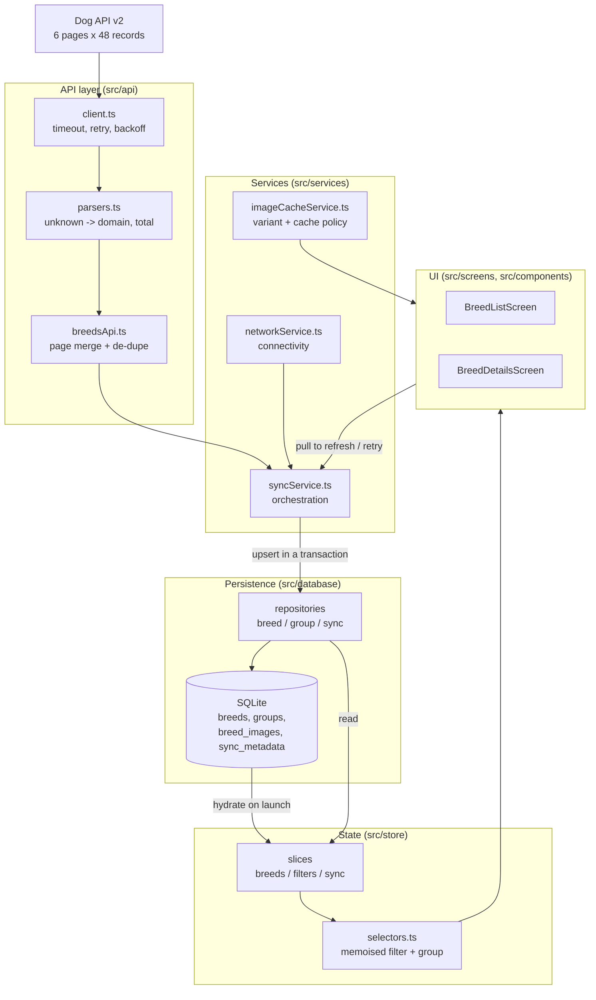

# Architecture

## System overview

The app is built around one rule: **SQLite is the source of truth for what the
user sees; the network is an optimisation.** Every screen reads from the local
database (projected into Redux), and synchronisation is a background process
that updates that database. This is what makes the app usable offline, on a
flaky connection, and during a partial API outage.

## Data flow

### Cold start (the offline-first path)

1. `useOfflineSync` dispatches `hydrationStarted`.
2. It reads breeds, groups and sync metadata from SQLite **in parallel** and
   dispatches `hydratedFromCache`. The list is interactive at this point — no
   network request has been made.
3. Connectivity is probed (`@react-native-community/netinfo`).
4. If online **and** the cache is empty or older than 6 hours, a background
   sync starts. Otherwise nothing further happens: the cached data stands.

The ordering matters. Rendering before the network probe is what makes a cold
launch in aeroplane mode identical to a cold launch on wifi.

### Synchronisation

1. `fetchAllBreeds` requests page 1 to learn the page count from
   `meta.pagination.last`.
2. The remaining pages are fetched **concurrently** with `Promise.allSettled`.
   Concurrency is safe because the pages are independent; `allSettled` is what
   keeps one failed page from discarding the other five.
3. Pages are merged through an id-keyed `Map`, ordered by page number, first
   occurrence winning. Duplicates are counted and dropped.
4. Groups are fetched in parallel and written first, so the breeds'
   `group_id` foreign key resolves.
5. Breeds are **upserted inside a single transaction** with prepared
   statements.
6. Sync metadata (status, timestamp, failed pages) is persisted so freshness
   survives a restart.
7. The hook re-reads SQLite and dispatches the result into Redux.

Step 7 is deliberate: after a partial sync, the database holds the union of
newly-fetched rows and previously-cached rows, which is a different (and
larger) set than the API just returned. Reading back is the only way to show
the user what they actually have.

### Failure handling

| Failure | Behaviour |
|---|---|
| Page 1 fails | Sync aborts. **Nothing is written.** Cache and its timestamp are preserved, banner shows the error with a Retry. |
| Pages 2-6 partially fail | Successful pages are written. Status is `partial`, failed page numbers are recorded, banner names them. `lastFullSyncAt` does **not** advance. |
| Groups fail, breeds succeed | Breeds are written. Status is `partial`; sections fall back to a readable label. |
| API returns 0 usable breeds | Treated as an **error**, not a wipe. Nothing is written. |
| One record is malformed | That record is skipped and counted; the other 282 are kept. |
| Device is offline | No sync attempted. Banner reads "Offline — showing cached breeds". |
| Connectivity returns | A sync fires on the offline→online **edge** only. |

## Database schema

`PRAGMA journal_mode = WAL` so list reads are not blocked by the sync
transaction's writes. `PRAGMA foreign_keys = ON` for the image cascade.
Migrations are versioned via `PRAGMA user_version` and applied in order inside
a transaction.

### `breeds`

The central design decision is **which fields get their own column**. Anything
the list screen filters, sorts or searches on is a scalar column with an index;
everything else is JSON. (Today the list filters in a memoised selector; these
columns keep the SQL path ready for scale. See DECISIONS.md §4.)

| Column | Type | Purpose |
|---|---|---|
| `id` | TEXT PK | API UUID |
| `name` | TEXT | Display name, indexed for ordering |
| `description` | TEXT | Detail screen |
| `group_id` | TEXT FK | → `groups.id`, `ON DELETE SET NULL`, **indexed** |
| `life_min/max` | REAL | Nullable range |
| `male_weight_min/max`, `female_weight_min/max` | REAL | Source for the size band |
| `male_height_min/max`, `female_height_min/max` | REAL | Size fallback |
| `hypoallergenic` | INTEGER | 1/0/**NULL** — null means the API did not say, **indexed** |
| `origin_era/region/country` | TEXT | Individually nullable |
| `coat_type`, `coat_length` | TEXT | Raw API values, shown on the detail screen |
| `coat_colors_json` | TEXT | JSON array |
| `traits_json` | TEXT | Full 1-5 score map |
| `exercise_minutes` | INTEGER | A duration (20-120), **not** a 1-5 score |
| `temperament_json` | TEXT | JSON array of tags |
| `trait_good_with_children/_dogs/_strangers` | INTEGER | **Denormalised** from `traits_json` purely so the threshold filter can be an indexed scalar comparison |
| `other_names_json`, `recognized_by_json`, `sources_json` | TEXT | JSON arrays |
| `size_band` | TEXT | **Derived** at parse time, **indexed** |
| `coat_category` | TEXT | **Derived** at parse time, **indexed** |
| `search_haystack` | TEXT | Lowercased `name + other_names`, precomputed |
| `thumbnail_url` | TEXT | First image's thumb, so the list needs no join |
| `synced_at` | INTEGER | Per-row write timestamp |

**Why derived columns are persisted.** `size_band`, `coat_category` and
`search_haystack` are computed once when a record is parsed, not on every
render or keystroke. Persisting them means a filter can be an indexed scalar
comparison instead of a scan that re-derives values for 283 rich objects.

**Why `thumbnail_url` is denormalised.** The list needs exactly one image URL
per breed. Without this column, rendering 283 rows would mean joining ~2,400
image rows to use 283 of them.

**Why the three trait columns are denormalised.** SQLite cannot index into a
JSON blob. These three are the ones the brief exposes as filters; the
remaining seven live only in `traits_json` because nothing queries them.

### `breed_images`

`(id PK, breed_id FK, position, thumb_url, medium_url, large_url, author,
license, license_url, source, source_url)`, indexed on `(breed_id, position)`.

A separate table because it is a genuine one-to-many (1–10 images per breed,
not the "up to 9" the brief states), and because keeping it separate lets the
list avoid loading images entirely. Attribution columns are first-class: for
CC-BY material they are licence terms, not decoration.

### `groups`

`(id PK, name, updated_at)` — 9 rows, used for section headers and filter
labels.

### `sync_metadata`

`(key PK, value, updated_at)` — a key/value store holding the serialised
`SyncState`. Key/value rather than typed columns so new sync fields do not
require a migration.

## State management

Three slices, each with one job:

- **`breeds`** — normalised projection of the cache, via
  `createEntityAdapter`. O(1) lookup by id for the detail screen; a
  pre-sorted id array for the list.
- **`filters`** — pure UI intent. Notably `searchInput` (every keystroke) is
  separate from `searchQuery` (committed after a debounce), so typing stays
  responsive while refiltering happens at most once per pause.
- **`sync`** — status, freshness, connectivity, failed pages.

Derived data is never stored. Filtering and grouping live in
`createSelector` memoised selectors, so they recompute only when the breed
array or a filter value actually changes.

`upsertMany` (not `setAll`) is used for sync results, so a partial sync adds
and updates without deleting breeds whose page failed. `setAll` is used only
when hydrating from the cache, where the cache genuinely is the full picture.

## API layer

`requestJson` returns `unknown` by design — narrowing is the parsers' job, so
no caller can accidentally trust an unvalidated payload. There is no `any` in
the codebase; the boundary is crossed with type guards in `src/utils/guards.ts`.

Errors are classified into `network | timeout | http | parse | aborted`, each
carrying a `retryable` verdict. Transport failures, 5xx, 408 and 429 are
retried with **full-jitter exponential backoff**; 404, malformed payloads and
caller cancellations are not, because retrying cannot fix them.

Parsers are **total**: every one returns a valid object or `null`, never
throws. A malformed record is skipped and counted rather than taking down the
page that contained it.

## Error boundaries

Boundaries wrap the app root, each screen, and the gallery separately. The
gallery gets its own because it is the most failure-prone surface (remote
images, decoding); a crash there costs the user the photo tab, not the app.
The boundary renders with static styles so it works even if the theme context
is what failed.
